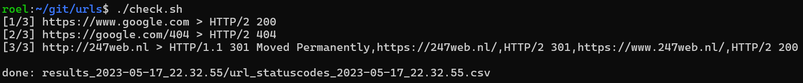
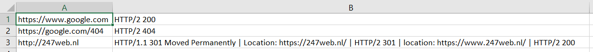
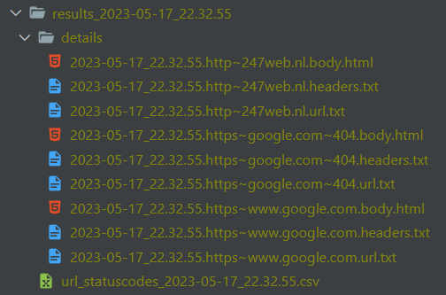

# Url checker with bash & curl

- Collect HTTP status codes, redirects, body and headers for a given list or urls.

# Example

### Console output



### For each run: 1 csv with all status codes

- /results_{datetime_started}/url_statuscodes_{datetime_started}.csv



### For each url:

- /results_{datetime_started}/details/{datetime_now}.{url_slug}.body.html (contains the HTML body)
- /results_{datetime_started}/details/{datetime_now}.{url_slug}.headers.txt (contains all headers)
- /results_{datetime_started}/details/{datetime_now}.{url_slug}.url.txt (the original url)



# Clone / Setup
```
git clone git@github.com:rboonzaijer/urlchecker-bash-curl.git

cd urlchecker-bash-curl

chmod +x check.sh

[ ! -f urls.txt ] && cp examples/urls.example.txt urls.txt

# NOTE: Set your own urls in 'urls.txt'
```

# Run
```
./check.sh
```
